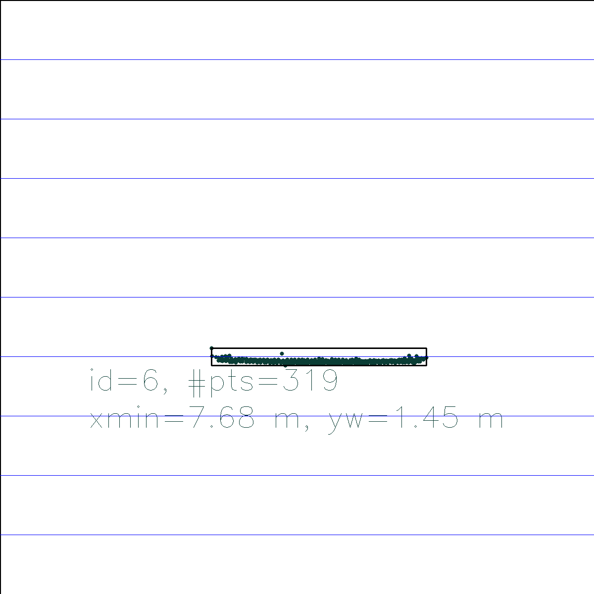
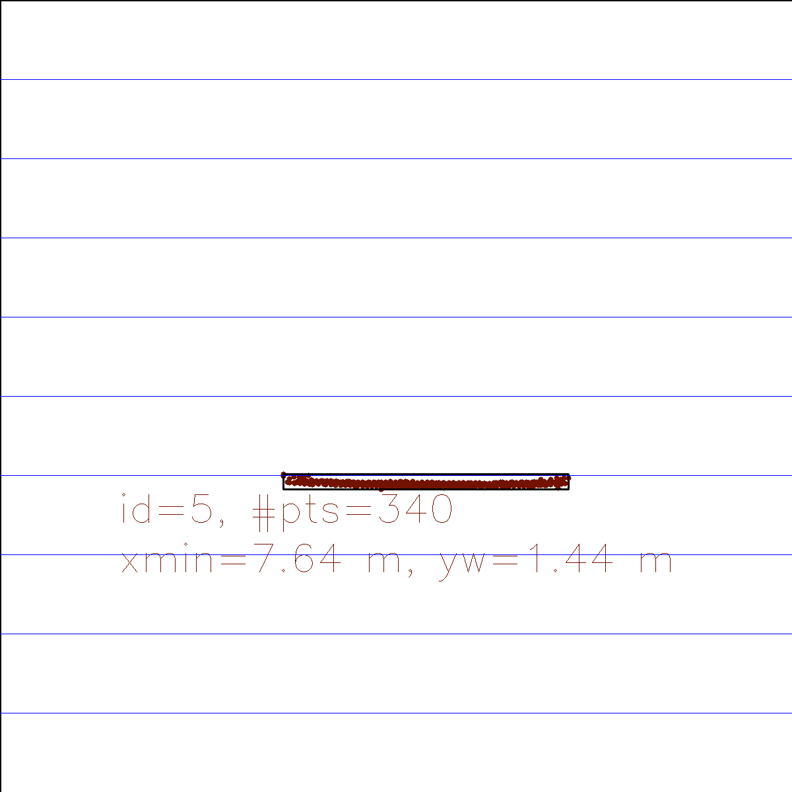
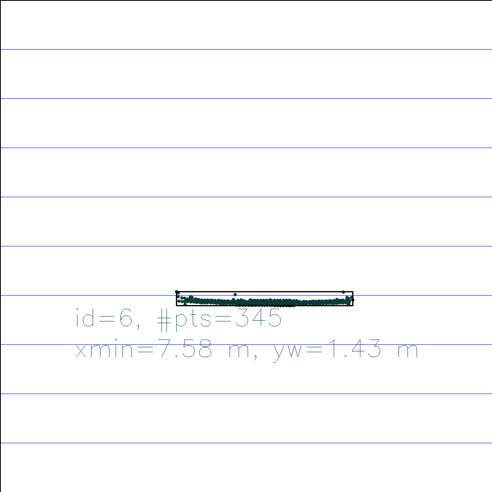
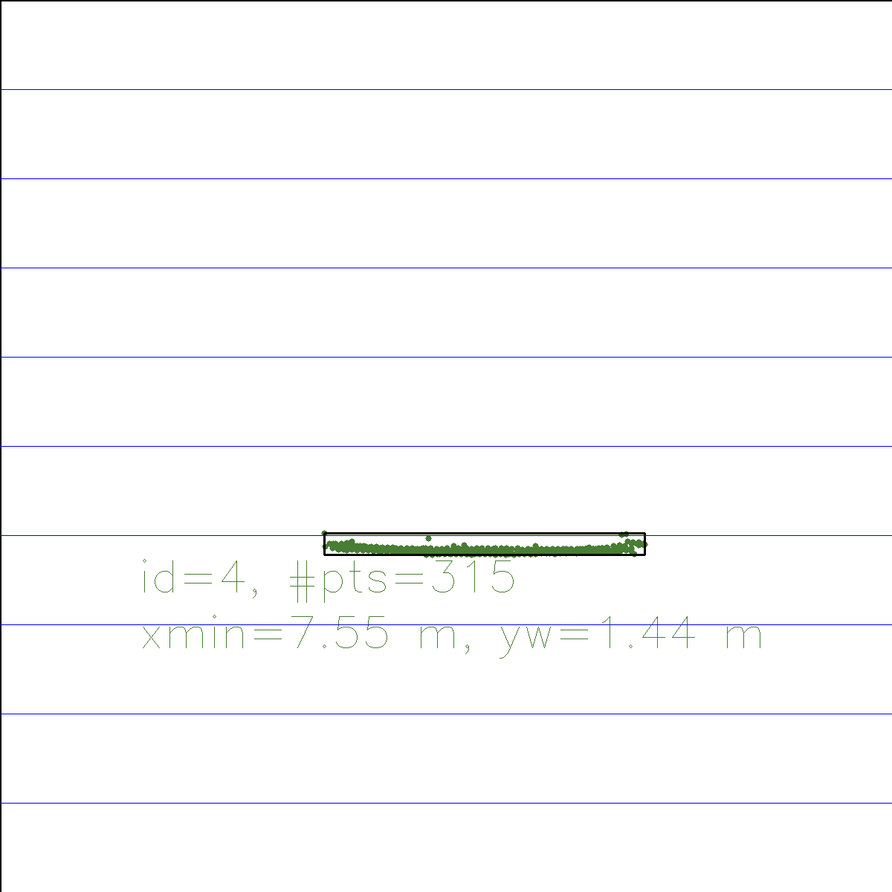
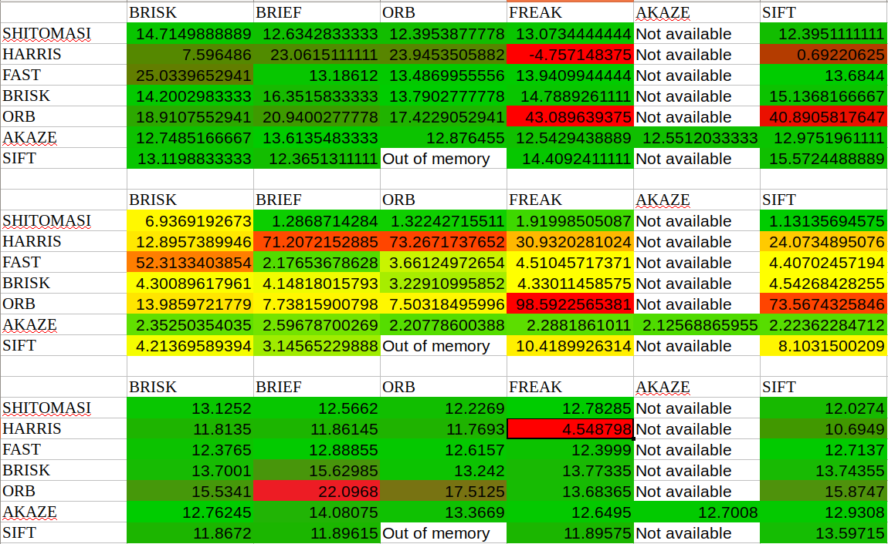

# Camera and Lidar Based 3D Object Tracking Project

This project sets up a complete object tracking pipeline using a lidar sensor and feature tracking on camera images.

## Task 1: Match 3D Objects

In this task the method *matchBoundingBoxes* is implemented. It takes the last two data frames and counts keypoint matches
within the bounding boxes. Bounding boxes with the most matches are then associated.

## Task 2: Compute Lidar-based TTC

In this task the time-to-collsion is calculated for all matched objects based on Lidar measurements.
The TTC can be computed using the simple formula:

> TTC = minimum_current_distance / (frameRate * (minimum_previous_distance - minimum_current_distance))

Since the lidar measurements might be rather noisy, outliers are filtered using the Interquartile range https://en.wikipedia.org/wiki/Interquartile_range,
i.e. points outside 1.5 the interquartile range are excluded.

After sorting the lidar points by distance:
```cpp
    // first and third quartiles
    const auto prevQ1 = lidarPointsPrev[lidarPointsPrev.size() / 4].x;
    const auto prevQ3 = lidarPointsPrev[lidarPointsPrev.size() * 3 / 4].x;
    const auto currQ1 = lidarPointsCurr[lidarPointsCurr.size() / 4].x;
    const auto currQ3 = lidarPointsCurr[lidarPointsCurr.size() * 3 / 4].x;

    // compute interquartile range: https://en.wikipedia.org/wiki/Interquartile_range
    const auto prevIQR = prevQ3 - prevQ1;
    const auto currIQR = currQ3 - currQ1;

    const auto compLidarPointsAndDouble = [](const LidarPoint &a, const double b) { return a.x < b; };

    const auto minXPrev = std::lower_bound(lidarPointsPrev.begin(), lidarPointsPrev.end(), prevQ1 - 1.5 * prevIQR, compLidarPointsAndDouble)->x;
    const auto minXCurr = std::lower_bound(lidarPointsCurr.begin(), lidarPointsCurr.end(), currQ1 - 1.5 * currIQR, compLidarPointsAndDouble)->x;

    // compute TTC from both measurements
    TTC = minXCurr / (frameRate * (minXPrev - minXCurr));
```

## Task 3: Associate Keypoint Correspondences with Bounding Boxes

*clusterKptMatchesWithROI* associates the keypoint matches with the bounding boxes. Again, outliers are excluded by computing the IQR of Euclidean
distance for each keypoint match. Matches with too high distances are simply discarded.

## Task 4: Compute Camera-based TTC

This part was already covered in one of the lectures. Based on keypoint matches the TTC can be estimated as 

> TTC = (-1.0 / frameRate) / (1 - medianDistRatio)

Here we use the fact that we cannot simply measure distances from camera images but we can still estimate the velocity from the change of 
distances between matched keypoints (i.e. their ratios).

## Task 5: Performance Evaluation 1

The statistics of the TTC calculation based on the Lidar measurements alone, comes out to be:

> Average = 13.0 s
> Median = 11.6 s
> Std Dev = 6.2s

From the standard deviation we already see that there were quite a few outliers in the resulting TTCs. Here are two examples of consecutive frames:


| Frame 1                                          | Frame 2                                        |  minX1       |minX2   |  TTC     |
| -                                                | -                                              |  -           | -      |  -       |
|     |   |  7.741       | 7.638  |  7.4     |
|     |   |  7.577       | 7.555  |  34.3    |

where minX1 and minX2 represent the distance to the closest Lidar point after outliers have been removed. From the images and the values of minX1 and minX2 
it seems like the outlier detection might not yet give the desired result. This becomes apparent in Examples 1 Frame 2 where all the Lidar points are already clustered in a narrow stripe which probably causes valid points to be excluded. This in turn leads to a higher estimated distance minX2 and a lower TTC.
Conversely, in Sample 2, the measurements are spread out which leads to a larger IQR and more outliers being accepted for the computation of minX1 in Frame 1. This leads to a lower minX1 and therefore a much higher TTC.

## Task 5: Performance Evaluation 2

All combinations of detectors/descriptors have been tested with BF matching, except SIFT, descriptors, which only work with FLANN matching.



From the statistics, we can see that the detector/descriptor configurations that have the least standard deviation for the TTC calculation are::

* SHITOMASI/SIFT
* FAST/BRIEF
* AKAZE/AKAZE

The analysis also reveals that some combinations give relative bad TTCs:

* HARRIS detector
* ORB detector
* FREAK descriptor

Further investigation revealed that these component generally produce much fewer matches which leads to unreliable TTCs.
